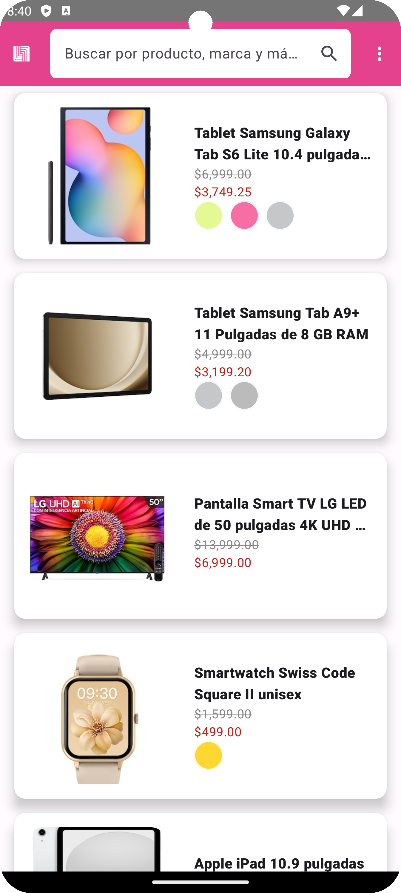
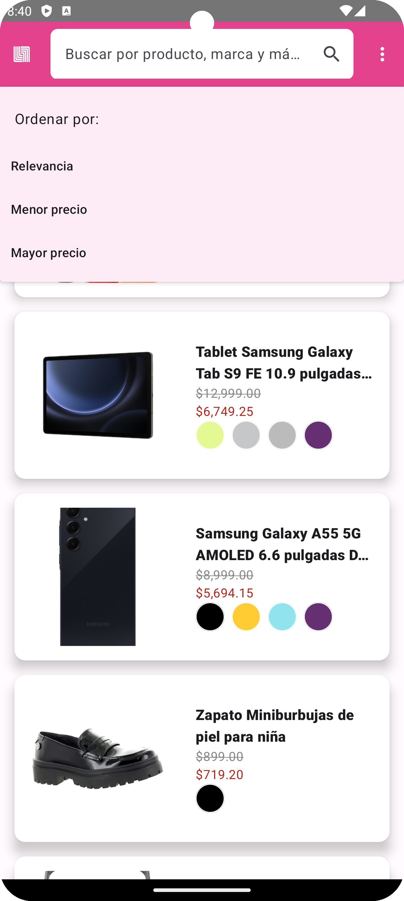
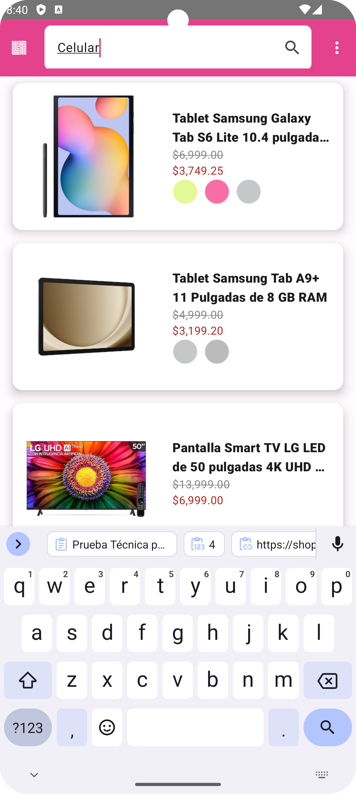
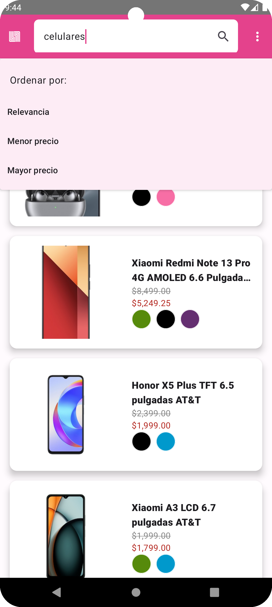

# Prueba de Desarrollo

## Objetivo

Se debe desarrollar una aplicación que permita realizar búsquedas de productos y muestre la lista de los productos encontrados. La lista de productos debe mostrar la siguiente información:

1. Imagen del producto.
2. Nombre del producto.
3. Precio sin descuento del producto.
4. Precio con descuento del producto.
5. Colores disponibles.

La aplicación también debe considerar que la lista de productos puede ser paginada (requiere múltiples consultas al servidor).

### API para la lista de productos

Para obtener la lista de productos disponibles se debe consultar la siguiente URL:

https://shoppapp.liverpool.com.mx/appclienteservices/services/v3/plp?search-string={{termino-de-busqueda}}&page-number=1

## Puntos Extra

La aplicación debe permitir establecer un ordenamiento para la búsqueda de productos (predefinida / menor precio / mayor precio). Una vez que se seleccione una nueva forma de ordenamiento, se debe actualizar la lista. A continuación, se proporcionan ejemplos de URLs para el ordenamiento:

1. **Predefinida:**
https://shoppapp.liverpool.com.mx/appclienteservices/services/v3/plp?search-string={{termino-de-busqueda}}&page-number={{numero-de-pagina}}
2. **Menor precio:**
https://shoppapp.liverpool.com.mx/appclienteservices/services/v3/plp?search-string={{termino-de-busqueda}}&page-number={{numero-de-pagina}}&minSortPrice|0
3. **Mayor precio:**
https://shoppapp.liverpool.com.mx/appclienteservices/services/v3/plp?search-string={{termino-de-busqueda}}&page-number={{numero-de-pagina}}&minSortPrice|1

## Desarrollo de la Prueba

> **Nota:** En esta última parte, los puntos extra no se lograron completar, ya que no se logró obtener la información de la API de Liverpool. La implementación está hecha, pero la organización de los datos no está llegando como debería (sospecho que el query proporcionado no es el correcto -> `minSortPrice|0`).

# Configuración del Proyecto

Este proyecto utiliza **Gradle** como sistema de compilación y **Version Catalogs** para gestionar las dependencias de manera centralizada.

## Dependencias Principales

El proyecto incluye las siguientes librerías clave:

- **AndroidX Compose**: Para la interfaz de usuario declarativa.
- **Kotlin Coroutines**: Para la programación asíncrona.
- **Retrofit y OkHttp**: Para las solicitudes HTTP.
- **Kotlinx Serialization**: Para la serialización de datos.
- **Dagger Hilt**: Para la inyección de dependencias.
- **Arrow**: Para la programación funcional.
- **Coil**: Para la carga de imágenes.

Las versiones y detalles específicos de estas dependencias se gestionan a través de un archivo `libs.versions.toml` utilizando la funcionalidad de Version Catalogs de Gradle.

¡
¡
¡
¡